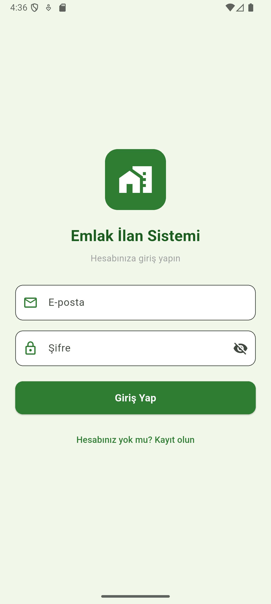
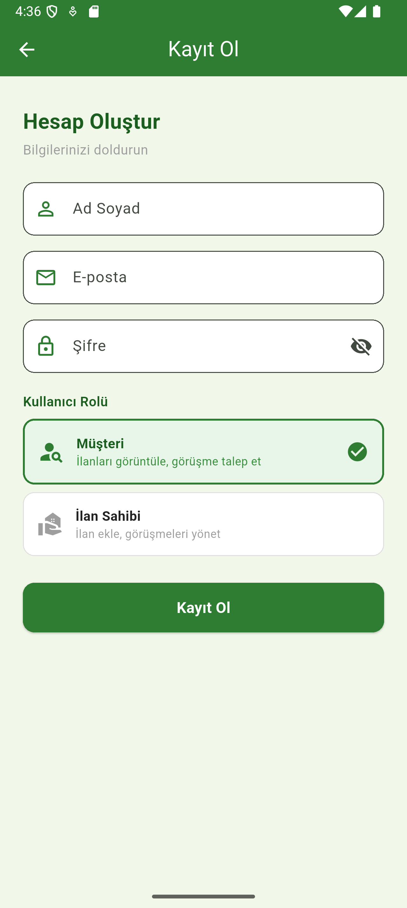
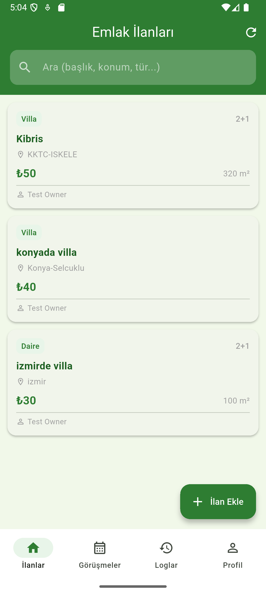
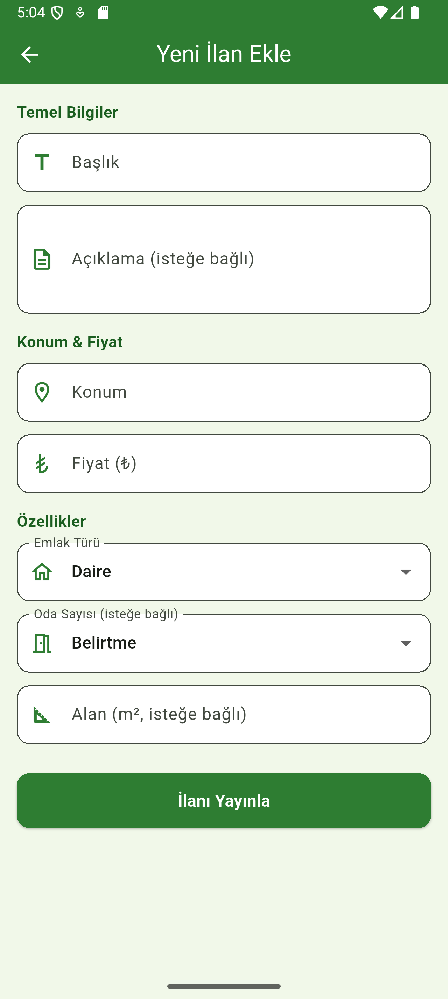
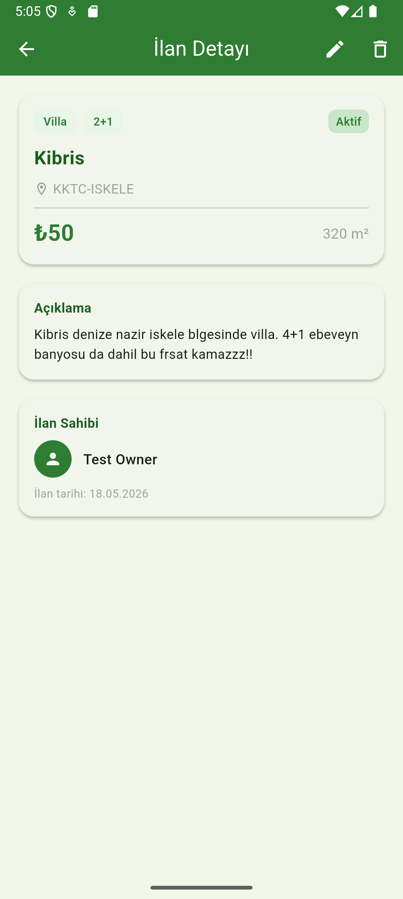

# Emlak İlan ve Görüşme Takip Sistemi

**Öğrenci:** Muhammed Emre Uysal  
**Numara:** 203301147  
**Ders:** Mobil Uygulama Geliştirme  

---

## Uygulama Hakkında

Emlak ilanlarını yönetmek ve müşteri görüşmelerini takip etmek için geliştirilmiş Flutter tabanlı mobil uygulamadır. İki farklı kullanıcı rolü (İlan Sahibi ve Müşteri) ile çalışır.

---

## Test Hesapları

### İlan Sahibi (Landlord)
| Alan | Bilgi |
|------|-------|
| E-posta | `owner@emlaktest.com` |
| Şifre | `123456` |
| Rol | İlan Sahibi |

### Müşteri (Customer)
| Alan | Bilgi |
|------|-------|
| E-posta | `customer@emlaktest.com` |
| Şifre | `123456` |
| Rol | Müşteri |

> **Not:** Bu hesapları uygulamada "Kayıt Ol" ekranından oluşturun.

---

## Kullanılan Paketler

| Paket | Versiyon | Açıklama |
|-------|----------|----------|
| `supabase_flutter` | ^2.8.4 | Authentication ve veritabanı |
| `intl` | ^0.20.2 | Tarih/saat ve para birimi formatlama |
| `cupertino_icons` | ^1.0.8 | iOS ikonları |

---

## Özellikler

- Kullanıcı kayıt, giriş ve çıkış (oturum kalıcı)
- İki rol: **İlan Sahibi** ve **Müşteri**
- İlan ekleme, düzenleme, silme (İlan Sahibi)
- İlan listeleme ve arama (tüm kullanıcılar)
- Görüşme talep etme (Müşteri)
- Görüşme onaylama / iptal etme (İlan Sahibi)
- Tüm işlemlerin log kaydı

---

## Ekranlar (9 Ekran)

1. Splash Screen
2. Giriş Ekranı
3. Kayıt Ekranı
4. Ana Liste (İlanlar)
5. İlan Detay
6. İlan Ekle / Düzenle
7. Görüşmeler
8. Loglar
9. Profil

---

## Ekran Görüntüleri







---

## Kurulum

```bash
flutter pub get
flutter run
```
